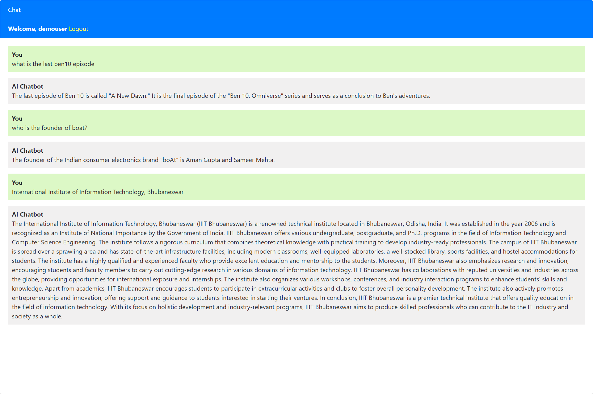
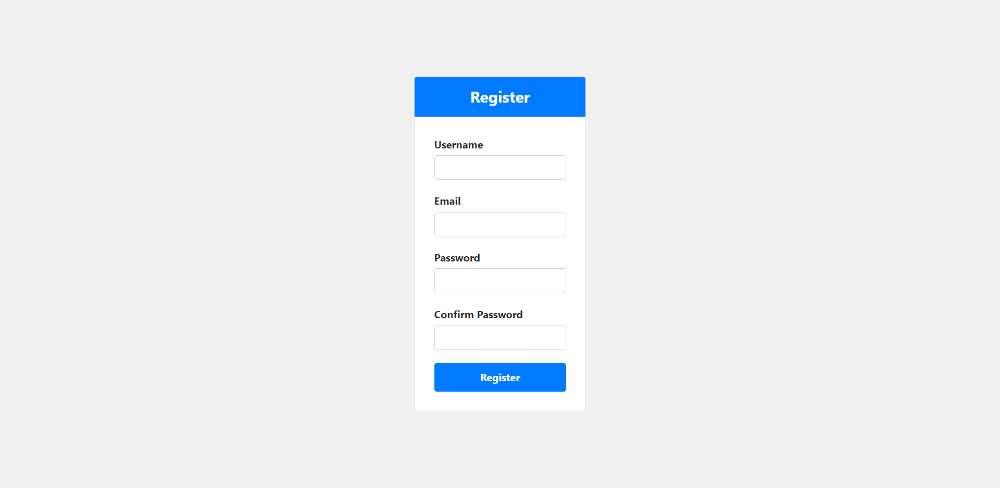
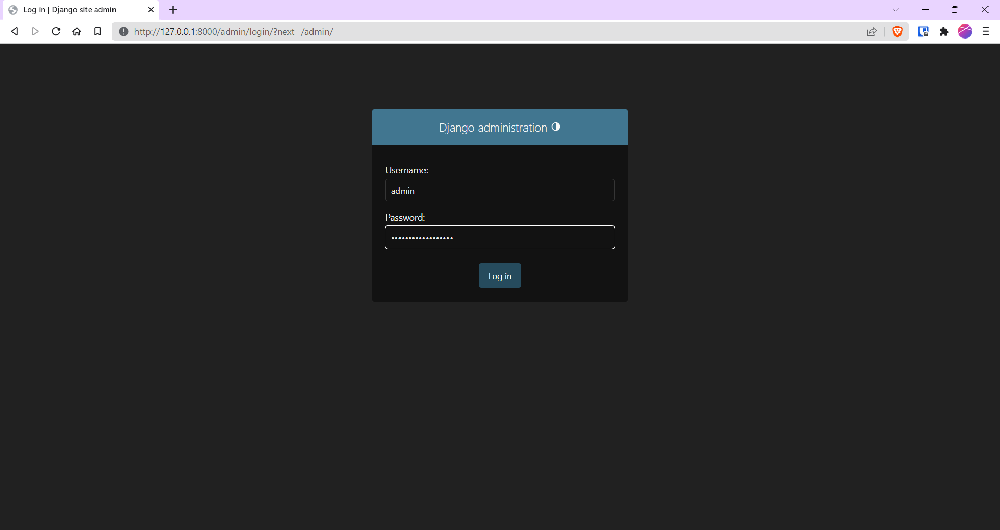
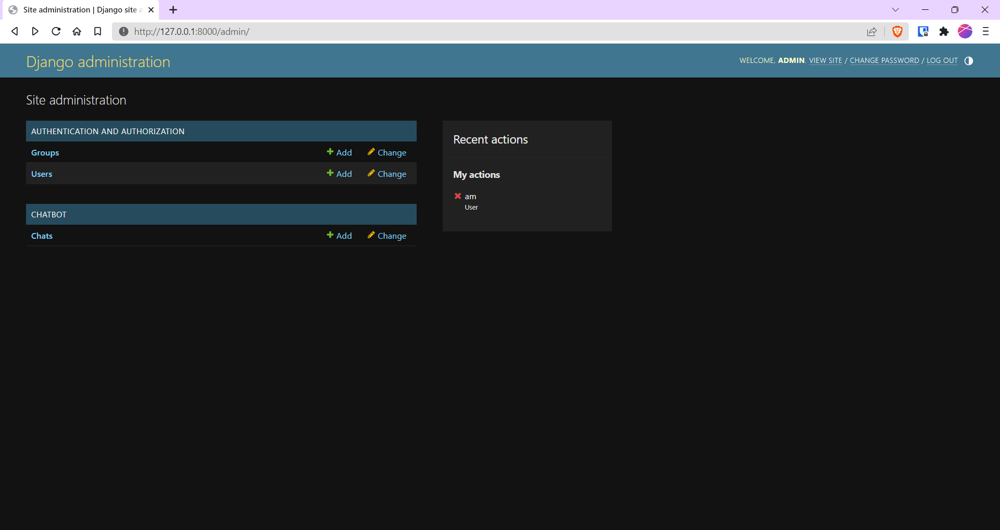
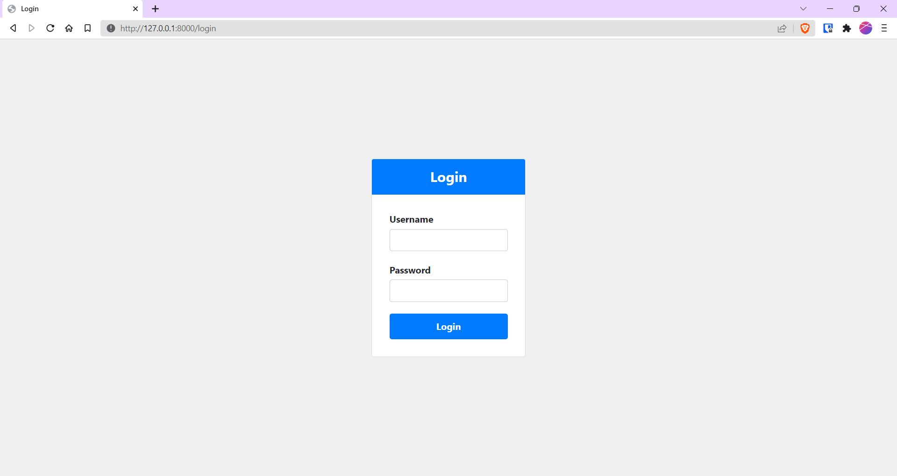

# Django ChatGPT Chatbot



Welcome to the Django ChatGPT Chatbot repository! This project aims to create a chatbot powered by GPT-3.5, a powerful language model developed by OpenAI. The chatbot is integrated into a Django web application, allowing users to interact with it in real-time and get responses based on natural language inputs.

## Features

- Real-time chat with GPT-3.5 powered Chatbot
- Seamless integration with Django web application
- Natural Language Processing for human-like interactions
- Easily extendable and customizable for specific use cases

## Prerequisites

Before you start using the Django ChatGPT Chatbot, make sure you have the following installed:

- Python (>= 3.6)
- Django (>= 3.0)
- OpenAI GPT-3.5 API key (sign up at [OpenAI website](https://openai.com) to get the API key)

## Installation

Follow these steps to set up the Django ChatGPT Chatbot:

1. Clone the repository:

```
git clone https://github.com/yourusername/django-chatgpt-chatbot.git
cd django-chatgpt-chatbot
```

2. Install the required Python packages using pip:

```
pip install -r requirements.txt
```

3. Set up your OpenAI API key:

   Open `views.py` in [chatbot folder](chatbot\views.py) and add openai_api_key:

   ```python
   openai_api_key = 'YOUR_API_KEY' # Replace YOUR_API_KEY with your openai apikey 
   openai.api_key = openai_api_key 
   ```

## Usage

To run the Django ChatGPT Chatbot, follow these steps:

1. Start the Django development server:

```
python manage.py runserver
```

2. Open your web browser and navigate to `http://localhost:8000/register` to create a new user account. 



3. You'll see the chat interface with the ChatGPT-powered chatbot ready to interact with you!

4. To create a `admin` user:

```python
python manage.py createsuperuser
```
You will be prompted to enter the details for the new admin user:

- **Username**: Choose a username for the admin user.
- **Email address**: Enter the email address for the admin user (optional).
- **Password**: Choose a strong password for the admin user. Note that the password will not be visible as you type it for security reasons.

After entering the required information, press Enter.

If everything is successful, you will see a message confirming that the admin user has been created:
```python
Superuser created successfully.
```
Congratulations! You have now created a Django admin user. You can now use this username and password to log in to the Django admin interface by accessing the `/admin/` URL .





5. To `logout`, navigate to `http://localhost:8000/logout`. You will be logged out and redirected to the login page.



## Contributing

I welcome contributions to the Django ChatGPT Chatbot repository! If you find any issues, have suggestions for improvements, or want to add new features, feel free to submit a pull request.

## License

The Django ChatGPT Chatbot is released under the [MIT License](LICENSE).

## Acknowledgments

I would like to thank the developers and contributors of the following libraries and tools, which made this project possible:

- Django: https://www.djangoproject.com/
- OpenAI GPT-3.5: https://openai.com

Happy chatting with ChatGPT! 🤖💬